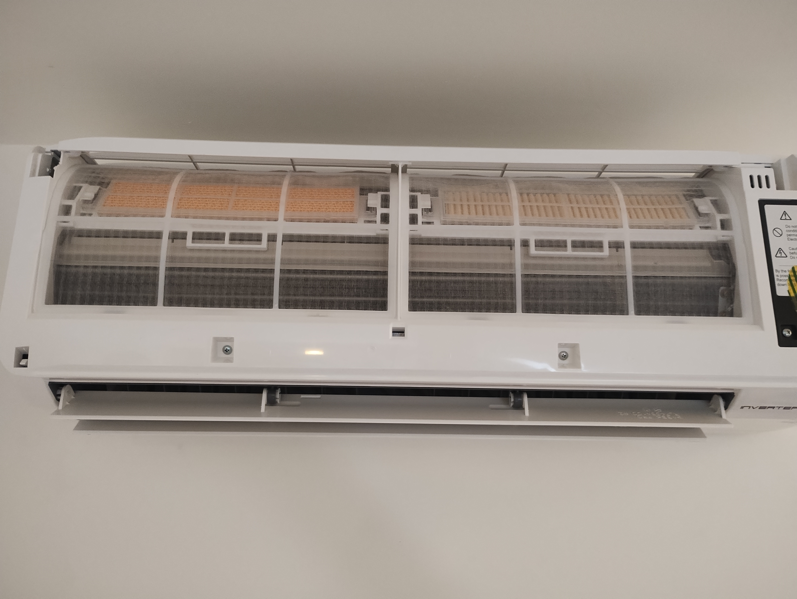
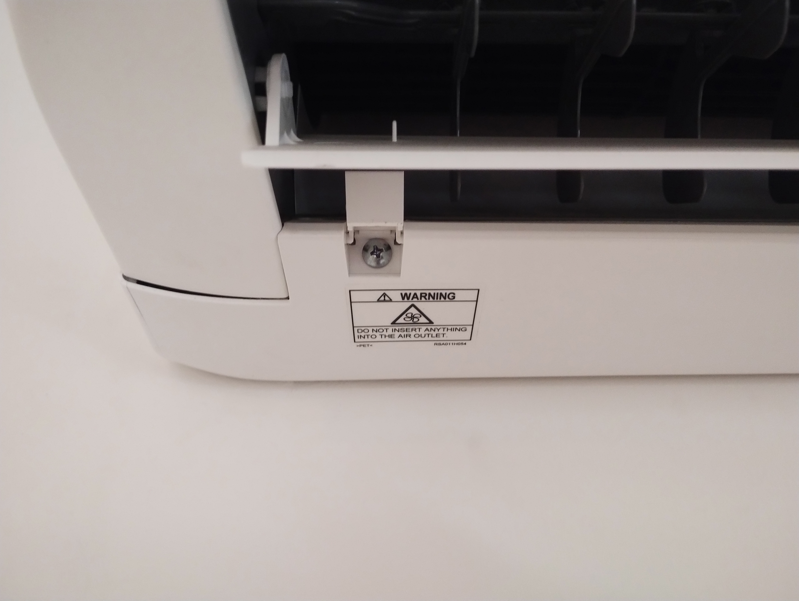
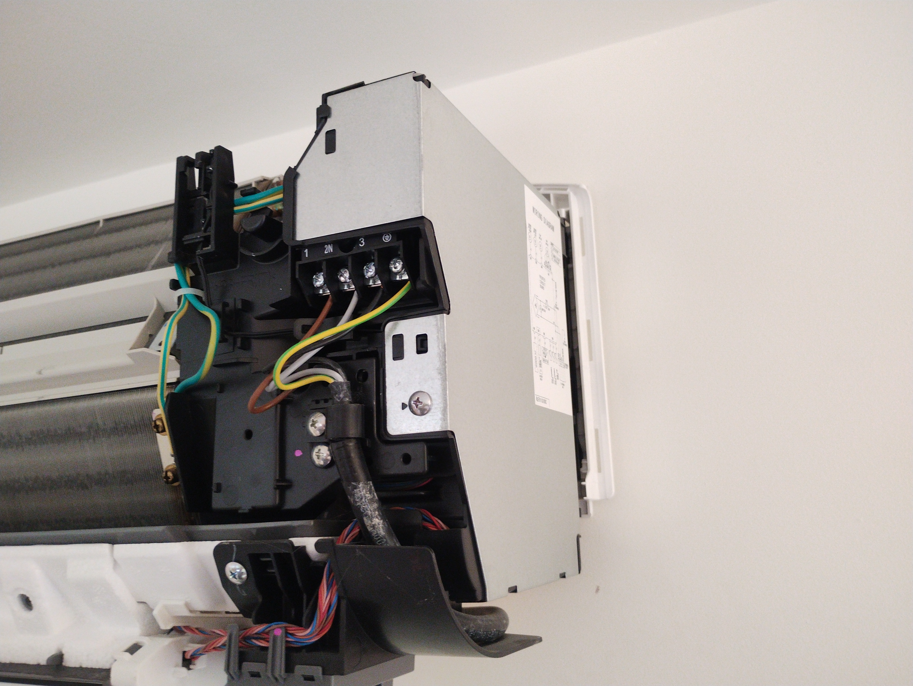
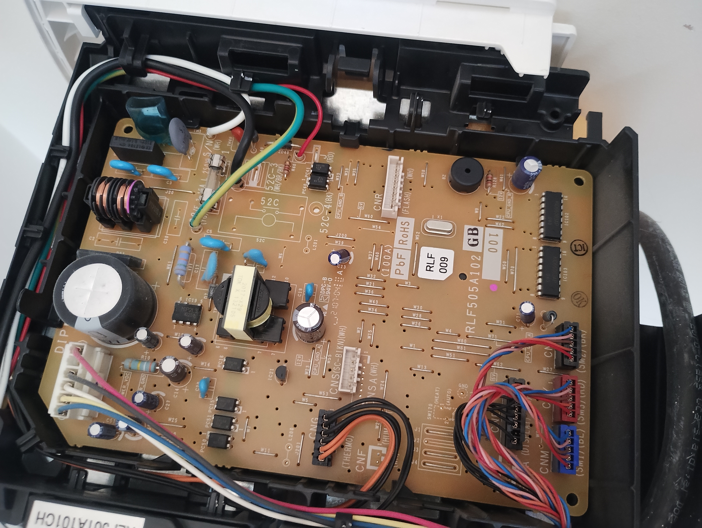

# Fitting the project to the Aircon Unit

Make sure to turn the power off before doing this. In my case that means going down a couple of flights of stairs. Don't be lazy, it's dangerous inside the unit, so play it safe!

First of all, take the front door off the unit to end up with something like this:

Remove the filters (mine were pretty clean, but now's a great time to clean up a bit!). Next, locate and remove the two screws in the front of the unit. Also find the two hidden screws covered with a sort of clip:

Getting the cover off the aircon unit is probably the worst part of this work. I'm sure there's a nice trick to it, but I couldn't figure out how to do it without making some pretty scary sounding cracking noises and bending plastic more than I'd imagine should be necessary. In short, there
are three "one way" clips at the back on top of the unit. These clips don't come out easily, and even when you've got the cover at a difficult angle, they still don't want to come out "nicely". The best I could do was a bit of brute force and ignorance, and then the main cover came off.

Once it's off, you can locate the cover over the circuit board on the right hand side:

Remove that cover to reveal the circuit board:

Locate the connector marked **CNS(SC-BIKIN)(WH)** and **CNSA(WH)**. If you have a connector marked CN105, then you have a Mitsubishi Electric aircon, and need a slightly different project!

On CNSA, the pinout from left to right on my photo is:

1. +12V (orange in my circuit)
2. SCL (yellow in my circuit)
3. MOSI (white in my circuit)
4. MISO (red in my circuit)
5. GND (black in my circuit)

Accidentally connecting +12V to any of the other 4 pins is likely to end up damaging your aircon unit. Be careful!

I was able to simply plug my project into the connector, and the place the box towards the back at the bottom of the circuit board, and then cover it with the metal cover before re-assembling the unit.

However you fit it, I recommend you check that it works before putting the plastic covers back onto the AC unit. They're hard to get off, so you don't want to have to do it more often than necessary.
