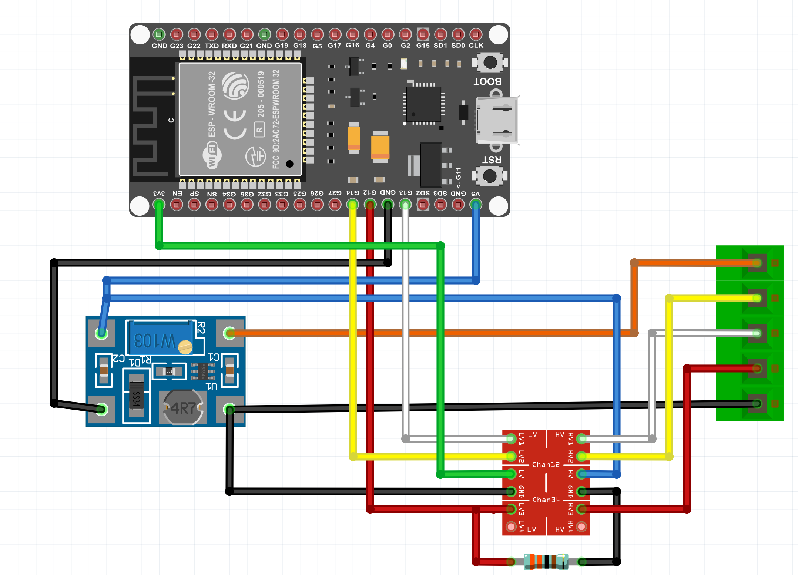

# Mitsubishi Heavy Industries (MHI) Air Conditioner to ESPHome

## Mitsubishi, or Mitsubishi?

There are two companies with competing air conitioner products. There's Mitsubishi Electric Corporation and Mitsubishi Heavy Industries. This project refers to the Mitsubishi Heavy Industries (MHI) line only. If you have a Mitsubishi Electric Corporation air conditioner, this project is not compatible (although extremely similar).

## What is this project?

This project integrated an MHI air conditioner with ESPHome and Home Assistant. It's not an original project, it builds on these excellent works:

- Probably the start of everything: https://github.com/absalom-muc/MHI-AC-Ctrl
- An excellent project by Wouter in the original [Dutch](https://www.twoenter.nl/blog/smarthome/mitsubishi-airco-voorzien-van-wifi-besturing/) or [English](https://www.twoenter.nl/blog/en/smarthome-en/mitsubishi-air-conditioner-equipped-with-wi%e2%80%91fi-control-using-mhi%e2%80%91ac%e2%80%91ctrl/)
- Another excellent project from which this project borrows software: https://github.com/ginkage/MHI-AC-Ctrl-ESPHome

The difference between this project and those above is that this one doesn't need a circuit board. It's assembled using some (hopefully) easy to source components, some wires and some sort of a plastic box (which can be 3D printed if you want).

## Ingredients

This project needs some components which are hopefully easy to source. They are:

- An ESP32. I used an ESP32 WROOM dev kit, it's the 38 pin type of ESP32. Something like these: https://www.amazon.co.uk/AZDelivery-unsoldered-Development-successor-compatible/dp/B0BFDL7W6N
- A 4 channel level shifter, something like this: https://www.amazon.co.uk/dp/B082F6BSB5
- A 5V buck converter, something like this: https://www.amazon.co.uk/dp/B0DY11F6N5
- A JST 2.54mm XH 5 pin connector (I bought these: https://www.amazon.co.uk/dp/B0CRZF4GCV)
- A 4K7 resistor (although maybe 3K9 or 3K3 would be better?)
- some wires, soldering iron, patience, etc.

Pretty much any ESP32 would probably work fine. As far as I know they all have SPI pins available, so they'll be fine for this. You absolutely need a level shifter because the aircon unit had 5V signals which will damage an ESP if they aren't shifted down to 3.3V first.
The aircon unit supplies 12V, so I used a buck converter to keep the heat down. I also picked a fixed 5V variety so that there was much less chance of accidentally getting anything other than 5V out of it.

With regards the resistor, this is required to pull the MISO pin low during power up. If it's not held low, the level shifter seems to pull it high enough that it stop the ESP32 from booting properly. I used 4K7s for mine, but in one case I had to substitute a 3K9 to make it work. As such, a slightly lower value may be preferable for all new implementations.

When I bought the connector, it came with pre-crimped wires attached, and also came with sockets as well as the needed plug. Actually, this turned out really helpful because I was able to make an extension lead which I was able to put into the aircon unit and leave it dangling outside when the cover was back on. That made debug and development much easier!

## How to make it

Before you start, I recommend getting your ESP32 flashed with the ESPHome software. Initially this requires plugging it in with a cable, so it's easiest to get that done before you do any soldering or fitting it into a box. Once it's done, you can update it wirelessly.

For software, see [SOFTWARE.md](SOFTWARE.md).

## Electronics

I made a Fritzing diagram of the circuit required. In the diagram, I couldn't find a component that looked exactly like my buck converters, and nor could I find the particular connector, but I'm sure it's clear enough to figure out what to do.

I found I could use the spare ground on the level shifter (on the HV side) as a place to bridge in the resistor to pull down the MISO line. I ended up with this:

I made a small 3D printed box with a sliding lid (Sketchup and STL files are in the `3dprinter` directory). The box is small enough that it can be placed in the space behind the metal cover that goes over the side circuit board. The box provides convenient electrical and physical protection, whilst also mounting and spacing the components quite easily. I bent the ESP's pins we're using sideways and trimmed off the other pins (my ESPs came fully soldered). This helps keep the box thin so it fits in the AC unit easily. I stuck the boards down using small sticky pads, although screws are also possible.

## Fitting the project to the aircon unit

See [FITTING.md](FITTING.md)

## A note about ESP32s, the MISO line, strapping pins and annoyances!

ESP32s have something called "strapping pins". These are used during initial boot to figure out what to do. For whatever reason, many (all?) ESP32s use whatever pin is connected to the internal SPI interface's MISO line as a strapping pin. This means you have to pull that pin low (or leave it unconnected) to get the ESP to boot.

I found that even just connecting that pin to the level shifter was enough to make it float high enough that the ESP wouldn't boot (it just blinked the LED really fast - very similar to a properly working but disconnected ESP, but if you look carefully it is a bit different!). It also turns out that the MISO line on the MHI aircon is pulled high before you even connect to it. The only solution was to pull it low as part of this project. It's a pain because it means you need to fit a single, random resistor. It also has the potential to degrade the signal from the MHI to the ESP32.

I played with a number of different values of resistor. I found that 4K7 was the highest I could use to make it work, but in one of the devices I made, it didn't work even with that. I used a 3K9 to resolve that problem, and it seems to work okay, so maybe 3K9 or even 3K3 is a better choice. I don't know for sure, but I suspect lower values will degrade the signal, so I'd advice keeping it as high as possible. Either way, it seems that pulling it low on the ESP side of the level shifters is beneficial.

Whilst diagnosing this problem, I also found some people recommending putting a 10uF capacitor between the EN (Reset) line and ground. This allows buck converters time to fully reach their output voltage before the ESP tries to boot. I didn't find this to be necessary, but it's possible different ESP models, or even different board types may have different characteristics. if so, you may need to add one of these too.
